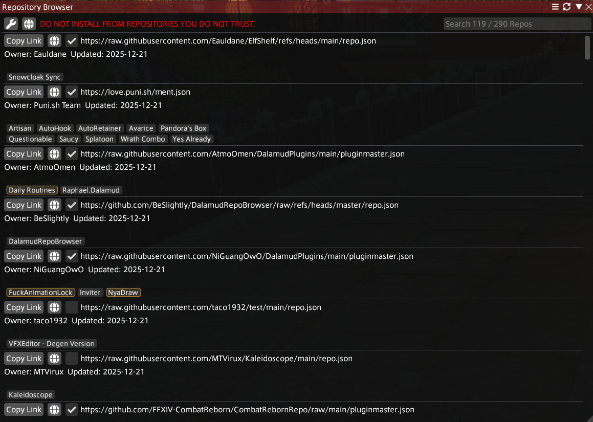
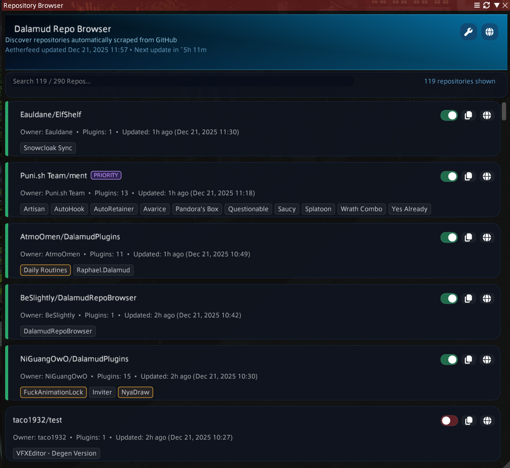

<div align="center">
  
  <h1>Dalamud Repo Browser</h1>
  <p>Browse and add third-party repositories to Dalamud with <code>/xlrepos</code>.</p>
  <p>Fork of the original <a href="https://github.com/UnknownX7/DalamudRepoBrowser">DalamudRepoBrowser by UnknownX7</a>.</p>

  <!-- Badges -->
  <a href="https://github.com/BeSlightly/DalamudRepoBrowser/releases"></a>
  <a href="https://raw.githubusercontent.com/BeSlightly/DalamudRepoBrowser/master/repo.json"></a>
</div>

---

## 📖 What is it?

**Dalamud Repo Browser** provides a clean, searchable interface for finding and adding third-party plugin repositories. It automatically pulls from [**Aetherfeed**](https://beslightly.github.io/Aetherfeed/), a repository masterlist that regenerates every 6 hours, ensuring you always have access to the latest community plugins.

Simply type `/xlrepos` in-game to browse, search, and toggle repositories instantly.

---

## 📥 Installation

Add this custom repo to Dalamud:

```
https://github.com/BeSlightly/DalamudRepoBrowser/raw/refs/heads/master/repo.json
```

---

### 🖼️ Screenshots

<div align="center">
  
  
  <p><em>Comparison: Legacy UI (Left) vs. New UI (Right)</em></p>
</div>
